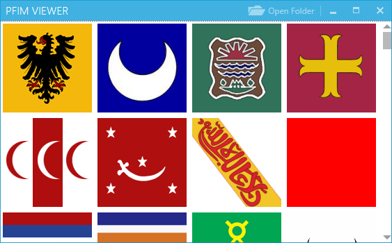
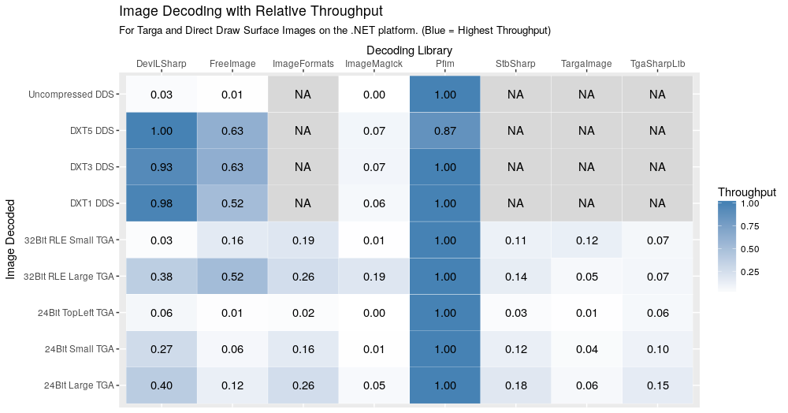

*A sample WPF interface that uses the Pfim library to load Targa and DDS images. Images are not my own*

Pfim is a .NET Standard 1.0 compatible Targa (tga) and Direct Draw Surface
(dds) decoding library with an emphasis on speed and ease of use. Pfim can be
used on .NET core, .NET 4.6, or Mono, so there is almost no place Pfim can't be
deployed.

## Motivation

I needed a C# [Targa](https://en.wikipedia.org/wiki/Truevision_TGA) and [Direct
Draw Surface (DDS)](https://en.wikipedia.org/wiki/DirectDraw_Surface) decoder
and the ones out there didn't satisfy my performance and portability needs, so
I wrote my own. As consequence, Pfim may not parse every Targa and DDS image.
If your image is not supported, please create an
[issue](https://github.com/nickbabcock/Pfim/issues) with the image attached.

## Installation

[Install from NuGet](http://www.nuget.org/packages/Pfim/)

## Usage

Pfim emphasizes on being frontend and backend agnostic. While it can be used
anywhere, the downside is that you may need some code to display the image in
whatever form desired, but as you'll see it is not hard!


// Load image from file path
IImage image = Pfim.FromFile(@"C:\image.tga");


If one already has the data stream and knows the format, each format can be directly called:


// Obtain a stream of data somehow
var stream = new MemoryStream();

// Creates a direct draw surface image
IImage image = Dds.Create(stream);

// Creates a targa image
IImage image2 = Targa.Create(stream);


## Benchmarks

The contestants:

- Pfim 0.5.1
- [DevIL](http://openil.sourceforge.net/) 0.0.13
- [FreeImage](http://freeimage.sourceforge.net/) 4.3.6
- [ImageMagick](https://www.imagemagick.org/script/index.php) 7.4.3
- [TargaImage](https://www.codeproject.com/Articles/31702/NET-Targa-Image-Reader) 1.0
- [ImageFormats](https://github.com/dbrant/imageformats) 1.0
- [StbSharp](https://github.com/rds1983/StbSharp) 0.6.8.33
- [TgaSharpLib](https://github.com/ALEXGREENALEX/TGASharpLib) 1.0

Each row represents an image that all contestants are given to decode. The
number of times a library can decode that image in a given time frame is the
throughput. Every cell shows the relative throughput to the fastest decoder in
the row (which has a relative throughput of 1.0). A relative throughput of
`0.1` would mean that the library is 10x slower than the library that has `1.0`
in the same row.

Notice Pfim is one of the fastest if not the fastest in each decoding each image.

**Caveat**: Some libraries do much more than decode images, and may not have the time or want the sacrifice that may come with optimizing the decoding process.

Image definitions:

- A large (1200x1200) 24bit (no alpha component) targa image
- A small (64x64) 24bit (no alpha component) targa image
- A large (1200x1200) 32bit run length encoded (RLE) targa image
- A small (64x64) 32bit run length encoded (RLE) targa image
- A small (64x64) uncompressed DDS image
- A small (64x64) DXT1 encoded DDS image
- A small (64x64) DXT3 encoded DDS image
- A small (64x64) DXT5 encoded DDS image

The benchmarking was done through [Benchmarkdotnet](https://github.com/dotnet/BenchmarkDotNet) and the benchmark code can
be found in the repo.

## Integrations

Since Pfim is backend and frontend agnostic, one has to write the appropriate translations. Below is the WPF specific code, which can be seen in the Pfim.Viewer sample project in the source code.


private static BitmapSource LoadImage(IImage image)
{
    PixelFormat format;
    switch (image.Format)
    {
        case ImageFormat.Rgb24:
            format = PixelFormats.Bgr24;
            break;

        case ImageFormat.Rgba32:
            format = PixelFormats.Bgr32;
            break;

        default:
            throw new Exception("Format not recognized");
    }

    // Create a WPF ImageSource and then set an Image to our variable.
    // Make sure you notify property changes as appropriate ;)
    return BitmapSource.Create(image.Width, image.Height,
        96.0, 96.0, format, null, image.Data, image.Stride);
}


Below is the code used in the Windows Forms sample, Pfim.Viewer.Forms (also found in the source code).


var image = Pfim.FromFile(dialog.FileName);

PixelFormat format;
switch (image.Format)
{
    case ImageFormat.Rgb24:
        format = PixelFormat.Format24bppRgb;
        break;

    case ImageFormat.Rgba32:
        format = PixelFormat.Format32bppArgb;
        break;

    default:
        throw new Exception("Format not recognized");
}

unsafe
{
    fixed (byte* p = image.Data)
    {
        var bitmap = new Bitmap(image.Width, image.Height, image.Stride, format, (IntPtr) p);
        pictureBox.Image = bitmap;
    }
}


## Release Notes

### 0.6.0 - March 28th 2019

* Added: `IImage::ApplyColorMap`, which will apply a colormap to the image, overwriting previous data and metadata like format, stride, pixel depth, etc. An example of a colormap is when an image only uses 256 colors. Instead of consuming 32 bits per pixel on disk, the image data instead will consist of 8 bit indices into the colormap located in the header of an image.
* Support Targa images orientated in the top left corner.
* Targa images encoded in the top right or bottom right corners (two extremely rare formats) fallback to bottom left corner decoding.
* Fix errors or incorrect decoding of dds images with widths and heights that aren't divisible by their block size.
* Fix `MipMapCount` misspelling in `DdsHeader`

### 0.5.2 - August 2nd 2018

* Include Mipmap data as part of `IImage::Data` for DDS images that skipped decoding
* Recognize and decode ATI2 dds images

### 0.5.1 - May 8th 2018

* Expose `BitsPerPixel` in `IImage`
* Add configuration to the decoding process via `PfimConfig`:
  * Configurable buffer size for chunk decoding
  * Allow opt-out of DDS BC decompression to allow for GPU offload.
* Optimize fast path for decoding `byte[]` data
* Latency of decoding BC DDS images decreased by 10%
* Highly experimental decoding of DX10 images.

### 0.5.0 - March 18th 2018

* Support for 24bit rgb dds images
* Support for additional 16bit dds images
  * Rgba16 (each channel is 4 bits)
  * R5g5b5a1
  * R5g6b5
  * R5g5b5
* Bug fixes for currently supported dds images
* Initial implementation for interpreting tga color maps
* Support for 16bit R5g5b5 tga images
* Support for 8bit tga images
* Fix bad calculation of tga strides

### 0.4.4 - October 31st 2017
* Fix red and blue color swap for TopLeft encoded targa images
* 20x performance improvement for TopLeft encoded targa images

### 0.4.3 - October 31st 2017
* Fix infinite loop on certain large targa and dds images

### 0.4.2 - October 10th 2017
* Release .NET Standard 1.0 version that doesn't contain File IO

### 0.4.1 - October 9th 2017
* Fix decoding of non-square uncompressed targa images
* Fix edge case decoding for compressed targa images

### 0.4.0 - September 17th 2017
* Released for netstandard 1.3
* 25% performance improvement on compressed dds images
* Bugfix in compressed targa decoder

### 0.3.1 - August 18th 2015
* Fix pixel depth calculations for compressed dds

### 0.3 - April 30 2015
* Internalized a lot of API to simplify usage
* Publish benchmarking

### 0.2 - April 29 2015
* All decoded images now derive from `IImage`

### 0.1 - April 26 2015
* Initial release
